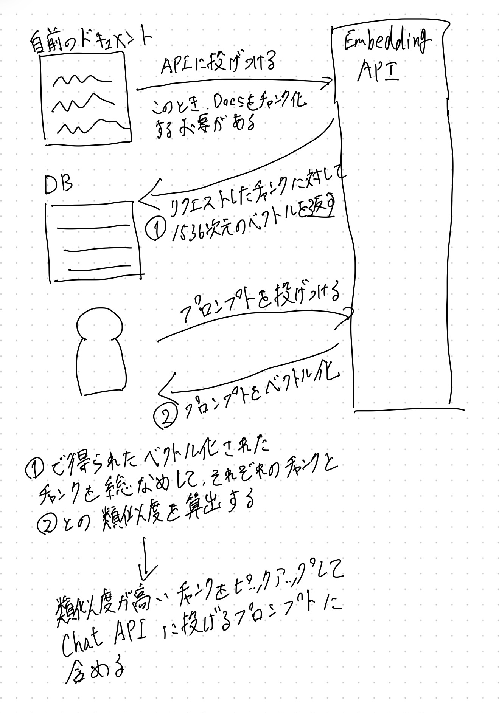

# ChatGPT に自前のドキュメントを読み込ませる方法

# 目次

- 1. 概要
- 1. 2つの方法の紹介
- 1. Fine Turning
- 1. Prompt Design
- 1. 実際に Embedding を使ってみた

# 1. 概要

- 仕事で ChatGPT について少し触れた
- その中で ChatGPT に自前のドキュメントを読み込ませて、それをもとに回答してもらう方法を調べた
- その中で Prompt Design の方法を実際にやってみた
- OpenAPI の Embedding API と Chat API を使って、実際に出力するまでの流れと感想をまとめた

# 2. 2つの方法の紹介
## Fine Turning

- 自前のドキュメントを、学習モデルに学習させる方法

## Prompt Design

- プロンプトを工夫する(自前のドキュメントをプロンプトに含める)方法

# 3. Fine Turning

OpenAI が Fine Turning ができる CLI ツールと、Fine Turning したモデルを使える API を用意しているため、それを利用して Fine Turning ができる。

## メリット

Prompt Design 与えられる学習量が多いため、うまく学習ができたら、Prompt Design よりも、望んだ回答が得られやすい。

## (実際に試してないけど)デメリット

- 以下のような教師データを作成する必要があり、学習させるデータを作成するのにコストがかかる(そのまま自前のドキュメントを読み込ませればよいわけではなく、教師データの形に加工する必要がある)

```json
{"prompt": "<prompt text>", "completion": "<ideal generated text>"}
...
```

- Fine Turning に使えるモデルが GPT-3
  - 2023/06/03現在、OpenAI が提供している API では Fine Turning に使用できるモデルは GPT-3
  - Fine Turning をさせた GPT-3 と Prompt Design をした GPT-3.5-turbo or GPT-4 だったら、どっちが意図した結果が出やすいのか...
    - ref: https://twitter.com/fair_lovewar/status/1650524544514531328?s=20

- Fine Turning だと、学習されたあとに出てきた情報を読み込ませることはできない
  - プロンプトを投げた時点での最新のデータを参照できない

# 4. Prompt Design

以下のように、プロンプトに自前のドキュメントを読み込ませて ChatGPT に回答させる方法。

```
以下の文章を読んだ上で、次の質問に答えてください。

# 読み込む文章

koheitakahashi の信念は「選択と集中」である。

# 質問

koheitakahashi の信念は?

```

```
> koheitakahashi の信念は「選択と集中」です。
```

## メリット

- Fine Turning よりも、データの準備にコストがかからない
  - 自前のドキュメントをそのまま読み込ませてもよい
- プロンプトを投げた時点の最新のデータを読み込ませることができる

## デメリット

- 一度に読み込ませられるドキュメントの量に限りがある
  - GPT3.5 turbo だと、4096トークン
  - GPT4 だと、最大16k
  - この制限を回避するために、**一度に読み込ませるドキュメントを選定するというステップが必要**

# 5. Prompt Design におけるトークン量の制約を緩和するための方法

自前のドキュメントを予め Embedding API を用いてベクトル化しておき、そのベクトルをもとに、与えられたプロンプトと類似するチャンクを抽出して、それをプロンプトに加えるという方法がある。

## Embedding API を使った流れ



ちなみに、チャンクとプロンプトの距離の計算はコサイン類似度を使って求めることが OpenAI のドキュメントでは推奨されているが、距離の計算方法の違いによる影響はほとんどないらしい。

> We recommend cosine similarity. The choice of distance function typically doesn’t matter much.
> https://platform.openai.com/docs/guides/embeddings/which-distance-function-should-i-use

$$\text{{cosine similarity}} = \frac{{A \cdot B}}{{\|A\| \cdot \|B\|}}$$


## 考えなければならないこと

- チャンク化する単位
  - チャンクに対して、ベクトルを返してもらう都合上、同じドキュメントでもチャンク化する単位により返されるベクトルの値が異なる
- 読み込ませるドキュメントの量に応じて、チャンクとプロンプトの距離の計算量が線形に増えていく
  - ここについては、ベクトルデータベースを使えば早くなるらしい

# 参考資料

- [Fine-tuning](https://platform.openai.com/docs/guides/fine-tuning)
- [Embeddings](https://platform.openai.com/docs/guides/embeddings)
- [DocsBotの仕組み](https://qiita.com/kenta1984/items/866cf407a27fccfe3b6f)
- [【完全保存版】GPT を特定の目的に特化させて扱う (Fine-tuning, Prompt, Index, etc.)](https://qiita.com/tmgauss/items/22c4e5e00282a23e569d)
- [Rubyのコードの例](https://github.com/koheitakahashi/embedding_api_sandbox)
